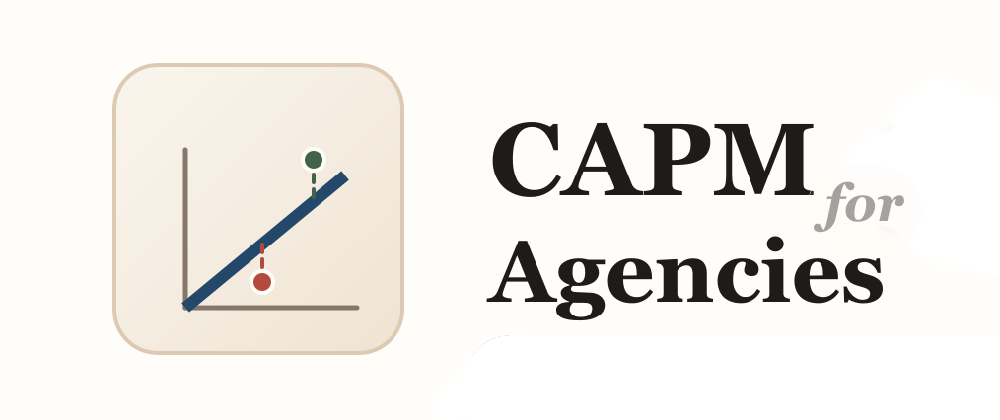

# CAPM for Agencies



Risk-based pricing tools for agencies, built around the Capital Asset Pricing Model (CAPM) adapted from financial economics.

**Live site:** [https://newlocalmedia.github.io/capm-for-agencies/](https://newlocalmedia.github.io/capm-for-agencies/)

## What this repo now contains

This repository now ships **two related apps** plus the supporting docs around them.

### 1. Decision Cards
The main app in [`index.html`](./index.html).

Use this when you want the full model:
- Layer 1 portfolio/systematic risk calibration
- Layer 2 engagement risk scoring
- the B Corp impact overlay
- retrospective review mode
- fuller theory, calibration, and supporting docs

### 2. Project Risk Check
The simpler guided app in [`project-risk-check/index.html`](./project-risk-check/index.html).

Use this when you want a smaller-agency path:
- one question at a time
- active default baseline margins
- plain-language explanations
- a simpler chart, recommendation, and tweak panel
- clear reset and validation behavior

It keeps the same shared hurdle math as the main hybrid model, but uses a simpler and more opinionated recommendation layer.

## Choose your path

- **Start with the Decision Cards** if you want the full framework, retrospective review, or the B Corp layer.
- **Start with Project Risk Check** if you run a smaller agency and want the pricing questions one at a time before moving into the fuller tool.
- **Start with the docs** if you want the argument first: Overview → TL;DR → Walkthrough → Decision Guide → Decision Cards.

## What the model is doing

Most agencies price risk through gut-feel contingency, hourly padding, or founder instinct. CAPM for Agencies adapts hurdle-rate logic into a framework that helps teams name risk before a deal is committed.

The main distinction is between:
- **systematic risk** — conditions affecting the whole portfolio or book of work
- **engagement risk** — deal-specific uncertainty that changes how much margin a project should clear

That yields a required margin, which can then be compared against the quoted or proposed margin.

## Main layers in the full app

### Layer 1: Systematic Risk Calibration
A periodic review of portfolio-wide conditions: platform stability, talent market, economic conditions, regulatory exposure, revenue concentration, and rate pressure.

Use the Layer 1 card:
- [Layer 1 card](./index.html#layer1-card)

### Layer 2: Engagement Risk Scoring
A per-deal assessment of client track record, scope clarity, technical complexity, internal capacity, contract type, political complexity, and timeline pressure.

Use the Layer 2 card:
- [Layer 2 card](./index.html#layer2-card)

### B Corp Impact Overlay
A mission-governance extension that adjusts the hurdle for work that is especially aligned, neutral, or harmful.

Use the B Corp card:
- [B Corp card](./index.html#bcorp-card)

## The shared formula core

The canonical formula source now lives in:
- [`scripts/shared-calc-core.mjs`](./scripts/shared-calc-core.mjs)

The main app still loads:
- [`scripts/calc-core.js`](./scripts/calc-core.js)

That file is a compatibility wrapper around the shared module so both apps stay aligned on the core hurdle, margin, floor-price, and beta logic.

## The formula

**E(R) = Rf + β × (Rm − Rf)**

In agency terms:

**Minimum Margin = Base Margin + (Engagement β × Layer 1 factor) × Risk Premium**

Where:
- `Engagement β = Engagement Score / 21`
- `Blended β = Engagement β × Layer 1 factor`

This is a midpoint-anchored design. A neutral engagement score maps to market-like `β = 1.0`, rather than forcing the low end to `β = 0`.

## Supporting docs

### Overview
- [`overview/index.html`](./overview/index.html)

### TL;DR
- [`tldr/price-the-work-before-you-plan-it.html`](./tldr/price-the-work-before-you-plan-it.html)

### Walkthrough
- [`tldr/walkthrough.html`](./tldr/walkthrough.html)

### Decision Guide
- [`tldr/decision-guide.html`](./tldr/decision-guide.html)

### Calibration Notes
- [`tldr/calibration-notes.html`](./tldr/calibration-notes.html)

### Discovery First
- [`essays/systems-thinking-for-web-development-agencies.html`](./essays/systems-thinking-for-web-development-agencies.html)

### Theory
- [`theory/index.html`](./theory/index.html)

## What this is good for

- aligning sales, solutions, delivery, and leadership
- pricing risk before delivery planning is overcommitted
- comparing quoted margin to a shared hurdle
- postmortem calibration through retrospective review
- giving smaller agencies a lighter guided entry point

This is pricing governance, not precise forecasting.

## Development

### Root app and docs
- `npm test`
- `npm run check:app`
- `npm run build:static`
- `npm run check:generated`
- `npm run ci`

### Guided app
From [`project-risk-check/`](./project-risk-check/):

```bash
npm test
```

## Hosting

GitHub Pages is configured from the root of `main`.

## License

This repository is licensed under the [Creative Commons Attribution-ShareAlike 4.0 International License (CC-BY-SA-4.0)](https://creativecommons.org/licenses/by-sa/4.0/).

## Credits

Dan Knauss • March 2026
