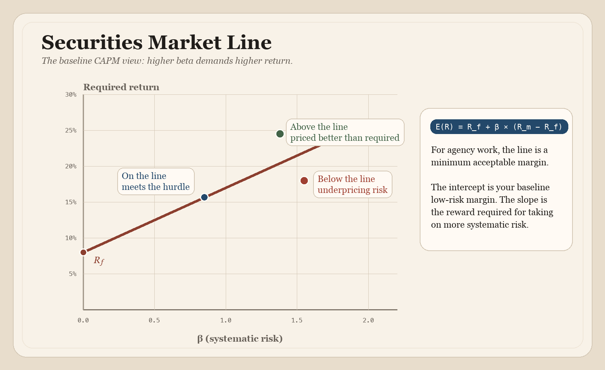
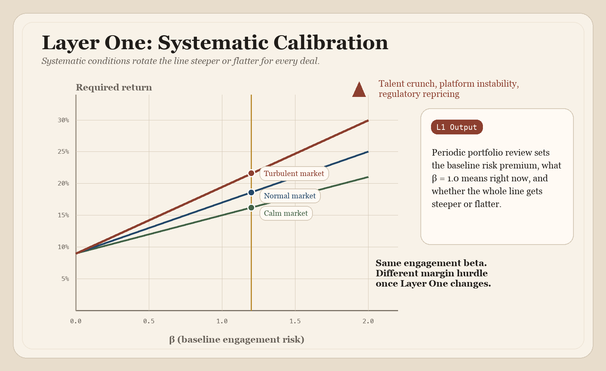
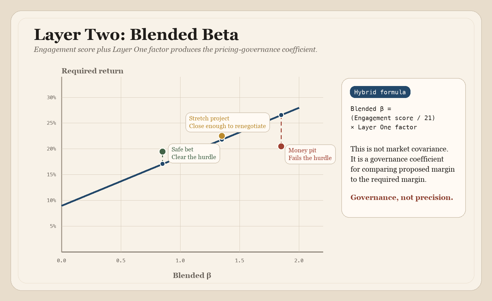
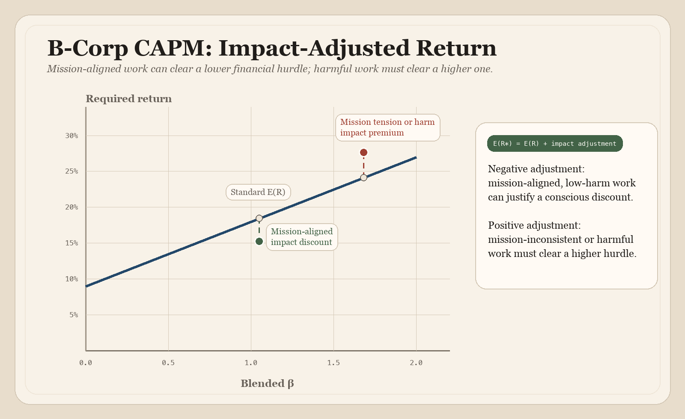
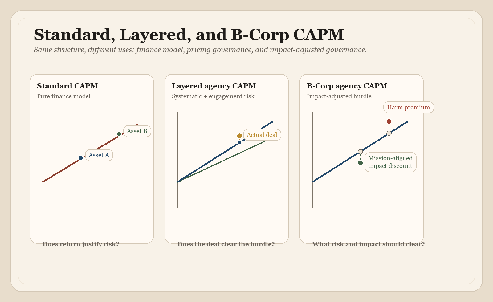

# CAPM for Agencies
*The Capital Asset Pricing Model Applied to Agency Project Pricing and Risk Assessment*

## Executive Summary

The goal of CAPM for Agencies is to **price the work before you plan it**. More precisely: price the work before *delivery planning* is committed, not before the solutions team has done enough technical assessment to judge complexity, client concerns, and whether the thing being sold should be implementation or discovery. It ensures that the agency is always compensated fairly for the uncertainty it accepts, protecting long-term profitability and sustainability.

### The Problem: "Gut-Feel" Pricing
Most agencies price project risk using arbitrary contingency percentages or hourly padding. These methods fail to distinguish between **systematic risks** (market-wide forces you cannot control) and **idiosyncratic risks** (project-specific variables that should wash out across a healthy portfolio).

### The Solution: A Principled Risk Framework
By adapting the **Capital Asset Pricing Model (CAPM)** from financial economics, this framework provides a structured language to replace "vibes" with defensible, portfolio-aware logic. It allows the agency to calculate a **minimum acceptable margin** based on the specific risk profile of every engagement.

### Key Components of the Model
* **The Hurdle Rate:** Your baseline revenue margin from low-risk, predictable work like retainers.  
* **The Risk Multiplier:** A measurement of how much riskier a project is compared to your average engagement.  
* **The Two-Layer Assessment:**   
  * **[Layer 1 (Portfolio)](../index.html#layer1-card):** Quarterly reviews of macro factors like platform stability, talent markets, and economic shifts.  
  * **[Layer 2 (Engagement)](../index.html#layer2-card):** Presales scoring of client track record, scope clarity, and technical complexity.

### Strategic Benefits
1. **Disciplined Go/No-Go Decisions:** Provides the math to say "no" to high-risk, low-margin "money pits" with data-backed confidence.  
2. **Cross-Functional Alignment:** Engages solutions, technical, and sales teams in a shared language for risk translation before a contract is signed.  
3. **[B-Corp Integration](../index.html#bcorp-card):** For impact-driven agencies, the model allows for a "conscious mission discount" on high-impact work while penalizing mission-inconsistent projects with higher margin requirements.

## Overview
Most small to mid-sized agencies (and even more large ones than want to admit it) price risk through gut-feel contingency percentages, hourly padding, or by shifting uncertainty onto clients via retainer models — none of which distinguish between the kinds of risk that matter most when they’re realized in events. These are the systematic risks that can’t be controlled. 

This agency-side diagnosis is not coming out of nowhere. Promethean Research's digital-agency pricing studies report that shops typically use multiple pricing methods at once, and that value-based pricing remains a minority practice rather than the norm. That helps explain why risk so often gets handled through padding, contingency, or deal-by-deal improvisation instead of through an explicit pricing model. See [Pricing Digital Services – Rates and Methods](https://prometheanresearch.com/pricing-digital-services-rates-and-methods/) and [Repeatable Revenue Generation for Digital Agencies](https://prometheanresearch.com/repeatable-revenue-generation-for-digital-agencies/).

For readers coming from outside finance, CAPM begins with a simple question: what return should be demanded for taking on a given level of risk? In investing, it is used to estimate required return, cost of equity, and hurdle rates. In agency work, the same logic helps separate market-wide risk from deal-specific risk, set a minimum acceptable margin, and decide whether a project is worth taking on at all.

Borrowing from CAPM, a foundational risk-based pricing model from financial economics, people in technical and non-technical roles at agencies of all sizes can bring a more principled framework to engagement pricing by separating *systematic* risk (factors correlated with agency-wide vulnerabilities like capacity crunches, platform/licensing shifts, or talent market contraction) from *idiosyncratic* risk (project-specific variables — including individual client dysfunction — that wash out across a healthy portfolio of engagements). For agencies, especially small and mid-sized shops, this is best understood as a governance model for pricing decisions rather than as a literal asset-pricing engine. 

Systematic risk deserves a pricing premium because it's the risk you can't diversify away by running a varied book of work. This gives agencies a structured language for what they usually handle by instinct — a principled basis for saying "this engagement's beta is high, so the required return needs to clear a higher bar," or even "we should walk away at this price" — replacing vibes with a defensible, portfolio-aware logic for go/no-go decisions and margin requirements. The hook is still right: price before you plan. But the practical meaning is price before *delivery* planning, not before presales solutioning. The practical win is not that the math is magically precise. It is that sales, solutions, delivery, and leadership are forced to name risk in a shared way before committing.

### Who Is This For?
Because of its roots in high finance, the CAPM formula translates most directly to agencies that are serving large enterprise clients. Any agency running a large payroll that may be distributed across multiple political jurisdictions, operating in multiple currencies, and so on, will find CAPM directly relevant because of the macroeconomic risks they face. But today, even small agencies are likely to have some of these attributes and share in the same risks. Every category of macro/global risk has some micro/local impact and analog.

The clearest audience split is this: **enterprise and international agencies** will usually find the pure approach easier to justify because their risk exposure genuinely tracks macro-level forces across a diversified portfolio. **Small and mid-sized agencies** will usually get more practical value from the hybrid approach, because a single engagement can still act like a portfolio-level event when the active book is small.

CAPM is classically capitalistic: hyper-risk-averse, relentlessly focused on a single bottom line, and blind to externalities. If an extended or triple-bottom-line is your jam, or you’re one of the growing number of agencies organized as a cooperative or B-Corps, you’re still in the same ballpark where impact joins risk and profit. There’s a whole section at the end of this book for you that adapts CAPM for agencies that account for stakeholder governance, externalities, and multi-capital returns.

## Contents

1. [Executive Summary](#executive-summary)
   1. [The Problem: "Gut-Feel" Pricing](#the-problem-gut-feel-pricing)
   2. [The Solution: A Principled Risk Framework](#the-solution-a-principled-risk-framework)
   3. [Key Components of the Model](#key-components-of-the-model)
   4. [Strategic Benefits](#strategic-benefits)
2. [Overview](#overview)
   1. [Who Is This For?](#who-is-this-for)
3. [Introduction: Two CAPMs](#introduction-two-capms)
   1. [The Origin and Applicability of CAPM for Agencies](#the-origin-and-applicability-of-capm-for-agencies)
4. [The Formula](#the-formula)
5. [Mapping CAPM to Agency Work](#mapping-capm-to-agency-work)
   1. [Risk-Free Rate (Rf): Your Baseline Revenue](#risk-free-rate-rf-your-baseline-revenue)
   2. [Market Return (Rm): Average Agency Profitability](#market-return-rm-average-agency-profitability)
   3. [Market Risk Premium (Rm - Rf): The Reward for Taking Risk](#market-risk-premium-rm---rf-the-reward-for-taking-risk)
   4. [Beta: The Project Risk Coefficient](#beta-the-project-risk-coefficient)
   5. [Expected Return E(R): What You Should Charge](#expected-return-er-what-you-should-charge)
6. [Two Approaches to Risk Assessment](#two-approaches-to-risk-assessment)
   1. [Enterprise Agencies and the Pure Approach](#enterprise-agencies-and-the-pure-approach)
   2. [Small-to-Mid-Sized Agencies and the Hybrid Approach](#small-to-mid-sized-agencies-and-the-hybrid-approach)
7. [A Two-Layer Risk Assessment](#a-two-layer-risk-assessment)
   1. [Layer One: Systematic Risk Calibration](#layer-one-systematic-risk-calibration)
   2. [Layer Two: Engagement Risk Scoring](#layer-two-engagement-risk-scoring)
8. [What Is Systematic Risk?](#what-is-systematic-risk)
   1. [How This Applies to Small Agencies](#how-this-applies-to-small-agencies)
   2. [PESTLE](#pestle)
   3. [Systematic Risk for Small Agencies and Freelancers](#systematic-risk-for-small-agencies-and-freelancers)
9. [What Is Risk-Free?](#what-is-risk-free)
10. [The Solutions Team as Risk Translator](#the-solutions-team-as-risk-translator)
11. [Worked Examples: Risk-Margin Comparison Table](#worked-examples-risk-margin-comparison-table)
   1. [Worked Example (Hybrid Approach)](#worked-example-hybrid-approach)
   2. [Worked Example (Pure Approach)](#worked-example-pure-approach)
12. [Relationship to PMI Earned Value Metrics](#relationship-to-pmi-earned-value-metrics)
13. [Limitations and Caveats](#limitations-and-caveats)
   1. [Addressing the Economists](#addressing-the-economists)
14. [Conclusion: Pricing the Work Before You Plan It](#conclusion-pricing-the-work-before-you-plan-it)
15. [CAPM for B-Corp Agencies](#capm-for-b-corp-agencies)
   1. [The Core Tension](#the-core-tension)
   2. [What the Academic Literature Says](#what-the-academic-literature-says)
   3. [How This Maps to Agency CAPM](#how-this-maps-to-agency-capm)
   4. [The B-Corp CAPM Formula](#the-b-corp-capm-formula)
   5. [Addressing the B Impact Assessment Gap](#addressing-the-b-impact-assessment-gap)
   6. [The Triple Bottom Line as Triple Risk](#the-triple-bottom-line-as-triple-risk)
   7. [Practical Implications for B-Corp Agencies](#practical-implications-for-b-corp-agencies)
16. [Glossary](#glossary)
   1. [Suggested Reading](#suggested-reading)

## Introduction: Two CAPMs
If you have absorbed some of the key project management concepts from the *Project Management Body of Knowledge* (PMBOK) or studied for the Certified Associate in Project Management (CAPM) exam, you know about value formulas, critical path calculations, and process group mechanics. Those tools answer *operational* questions: Are we on schedule? Are we on budget? How efficiently is work getting done?

But there is an earlier, more strategic question that most project management frameworks skip entirely: ***Should we take this project at all?***

CAPM (the financial model, not the PM certification) provides a framework for answering exactly that question. It calculates the expected return on an investment given its risk relative to the market. In an agency context, each client engagement is an investment of time, capacity, and reputation. The financial CAPM gives you a principled way to decide whether the expected return on that engagement justifies the risk you are taking on. In this adaptation, especially in the hybrid layer, the value is organizational discipline more than quantitative purity.

The rest of this document is written as a practical guide for agency teams. It introduces the financial CAPM, maps each of its components to *agency* realities, and shows how to assess and price risk before the project ever hits a Gantt chart. It also argues for using CAPM as a bridge between people and teams forming around a new project or proposal before it has become a contract with a client. That does not eliminate the need for early technical thinking. It means doing enough presales solutioning to price responsibly without slipping into unpaid delivery planning. In the pure approach, the mapping stays closer to the original theory. In the hybrid approach, the model becomes explicitly heuristic: a pricing-governance framework that borrows CAPM's structure to support better internal decisions.

Risk assessment is something a good sales executive does, and it’s central to solutions teams, project managers, and even delivery and strategy teams in enterprise agencies. Engaging senior technical and project staff in pricing estimation and project scoping at the end of the sales funnel — rather than siloing them from it — will produce better outcomes. 

If consultative sales and proposals informed by technical team members are already your practice, CAPM gives you a simple model to formalize the risk assessment you're already doing intuitively. Everyone on agile, cross-functional teams will have their own take on how to run the numbers. Let them — and take the average to draw on your own “wisdom of the crowd.”

### The Origin and Applicability of CAPM for Agencies
Dating back to the 1960s in its origins, CAPM remains a popular instrument in finance but has been heavily criticized over the decades by a number of economists. The heavy criticisms of CAPM are almost entirely aimed at CAPM as a predictive model of actual market returns. Our agency application isn't doing that. It's using CAPM as a decision framework for pricing risk. Those are fundamentally different use cases.

I vaguely knew about the Capital Asset Pricing Model (CAPM) from financial economics before I had ever heard of the same acronym in project management — the Project Management Institute’s (PMI) Certified Associate in Project Management. When I saw the latter being used as a credential, I wondered if it had to do with capital asset pricing applied to project management. Nope\!

But then I asked, Why not? Hasn’t anyone made this connection? The answer turned out to be “nope” again.

I didn’t see any strong reasons why CAPM wouldn’t be helpful in an agency context, so I started talking to Claude (AI) and human colleagues about it. This led to further research, reading, writing, and revision — and a website. This is the result — a CAPM-inspired agency risk-based pricing assessment model. It is closest to finance theory when used as a hurdle-rate framework at the portfolio level, and more heuristic when translated into per-engagement scoring for day-to-day agency work.

If CAPM (the financial model) is unfamiliar to you, you can get some good background on it in its original context from “[Does the Capital Asset Pricing Model Work?](https://hbr.org/1982/01/does-the-capital-asset-pricing-model-work)” (HBR, 1982). The author, David W. Mullins, Jr., a future Fed Vice Chairman, was then a Harvard Business faculty member and expert on financial crises. He was responding to the heaviest criticism CAPM has ever received, in the late 1970s. 

Mullins defends CAPM as a useful model for *disciplined thinking about risk*, specifically systematic risk (i.e., beta) —  the things you cannot control and are not responsible for. He recommends CAPM as a practical, primary benchmark for evaluating risk-adjusted returns — exactly what agencies need for project selection.

*Dan Knauss*

## The Formula
**E(R) \= Rf \+ β × (Rm − Rf)**

**Expected Return \= Risk-Free Rate \+ β × (Market Premium)**

| Component | Definition |
| :---- | :---- |
| **E(R)** | **Expected Return** — the return you should expect (or demand) from the investment, given its risk. |
| **Rf** | **Risk-Free Rate** — the return you would earn on a zero-risk investment. In finance, this is typically the yield on US government treasury bonds. |
| **β (Beta)** | **Beta** — a measure of systematic risk. Beta \= 1.0 means the investment moves with the market. Beta \> 1.0 means more volatile (riskier); Beta \< 1.0 means less volatile (safer). |
| **Rm** | **Market Return** — the average return of the overall market. |
| **Rm − Rf** | **Market Risk Premium** — the extra return investors demand for taking on market risk instead of the risk-free alternative. |

The core insight: you should never accept a return lower than the risk-free rate, and the more risk you take on, the higher the return you should demand.

*Figure 1. Security Market Line illustration. [PDF version](./figures/security-market-line.pdf).*

In the standard model, every asset should sit on the Security Market Line (SML). From here on, we’ll call it “The Line.” Anything above the Line is delivering more return than its risk warrants; anything below the Line is underperforming. 

## Mapping CAPM to Agency Work
Each component of the CAPM formula has a direct analog in the agency project pricing, planning, and management context. The mapping is not merely metaphorical. It reflects real financial and operational dynamics that determine whether a project is worth pursuing. Here’s the agency remix:

**Minimum Acceptable Margin \= Base Margin \+ β × (Risk Premium)**

### Risk-Free Rate (Rf): Your Baseline Revenue
In finance, the risk-free rate is the return on a government bond, virtually guaranteed. In agency work, the risk-free rate is the revenue you can earn from low-risk, predictable work. This includes retainer contracts with established clients, ongoing maintenance and support agreements, and internal projects or products with predictable returns. These are engagements where scope, client behavior, technology, and payment are all well understood. The risk-free rate is your floor: the return you are guaranteed if you never take on anything uncertain.

### Market Return (Rm): Average Agency Profitability
The market return is the average profitability across your portfolio of projects or, more broadly, across comparable agencies in your market. If your typical industry peer nets 15–25% margins on project work, that range represents the market return. Your own historical data — average project margin across the last two years — is the most useful benchmark.

### Market Risk Premium (Rm - Rf): The Reward for Taking Risk
This is the spread between your safe baseline work and your average project returns. If retainer work yields 10% margins and your average project yields 20%, the risk premium is 10 percentage points. 

That premium is what you earn for accepting exposure to *systematic* forces that retainer work tends to insulate you from: platform shifts that reprice your deliverables, economic downturns that stall approvals across multiple clients, talent market contractions that inflate your cost basis mid-engagement, and rate compression from emerging tooling that affects your entire rate card. 

Retainer work functions as the "risk-free" baseline, not because it's easy, but because the revenue is contracted and predictable — it arrives regardless of what the broader market does. Project-specific variables like scope changes, client delays, and integration surprises are idiosyncratic risks that belong in per-project contingency planning, not in the risk premium itself.

### Beta: The Project Risk Coefficient
This is where it gets interesting for agency practitioners. Beta measures how much riskier (or safer) a specific project is compared to your average project. A project with beta \= 1.0 carries average risk. A project with beta \> 1.0 is riskier than typical, and a project with beta \< 1.0 is safer.

In an agency context, beta is determined by two layers of risk assessment. At the portfolio level, systematic factors like platform stability, talent market conditions, and economic environment set the baseline. At the engagement level, project-specific factors adjust that baseline for each opportunity. The Two-Layer Risk Assessment section later in this document provides scoring tools for both. The engagement-level factors include:

* **Client track record** — Have they worked with agencies before? Do they provide feedback on time? Do they pay reliably?

* **Scope clarity** — Are requirements well-defined, or does the opportunity require a paid discovery phase before implementation can be priced confidently?

* **Technical complexity** — Is this a familiar stack, or does it involve unfamiliar APIs, legacy systems, or experimental technology?

* **Internal capacity** — Does your team have bandwidth, or will this stretch resources across multiple commitments?

* **Contractual structure** — Fixed-price (higher risk) versus time-and-materials (lower risk)?

* **Political complexity** — How many stakeholders exist with decision-making authority? How aligned are they?

* **Timeline pressure** — Is there an immovable deadline driven by a launch event, regulatory requirement, or board commitment?

### Expected Return E(R): What You Should Charge
The expected return is the minimum margin you should demand for the project given its risk profile. If a project has high beta (risky client, unclear scope, tight timeline), your expected return must be correspondingly higher to justify the risk. If you cannot price the project to meet or exceed that expected return, the CAPM framework tells you to walk away — or renegotiate terms until the risk-reward ratio makes sense.

## Two Approaches to Risk Assessment
The CAPM framework can be applied at two levels of rigor depending on agency size, client profile, and operational complexity.

1. **The pure approach** separates systematic and idiosyncratic risk cleanly. Systematic risk is assessed at the portfolio level through periodic strategic review. Idiosyncratic risk is handled per-engagement through contingency planning and contract structure. The CAPM formula prices only the systematic component. This approach is most natural for international and enterprise agencies whose risk exposure genuinely tracks macro-level forces: currency fluctuation, cross-jurisdictional regulation, global talent market dynamics, and platform ecosystem shifts at scale. Agencies serving Fortune 500–5000 clients, operating across borders, or running payrolls in multiple currencies will find the pure approach maps closely to the risks they already feel.

2. **The hybrid approach** acknowledges that at small to mid-sized scales, the clean separation partially breaks down. When an agency runs five to fifteen projects at a time, idiosyncratic risk doesn't wash out — there aren't enough engagements for the law of large numbers to help. A single difficult client or a single botched scope *is* a portfolio-level event when it represents 20–30% of your active work. The hybrid approach incorporates both systematic exposure and engagement-specific factors into a combined risk assessment, with the honest acknowledgment that this is a practical adaptation of CAPM rather than a strict application of it. More precisely, it should be understood as **heuristic pricing governance** rather than as a direct translation of asset-pricing theory. This is the more broadly applicable model, and for most agencies reading this document, it will be the right starting point.

**Both approaches use the same formula.** *The difference is in how beta gets calculated and who is responsible for what.* In the hybrid approach, that beta is a scored managerial coefficient, not a statistically estimated market covariance.

### Enterprise Agencies and the Pure Approach
For enterprise agencies, the pure approach is not just tidier in theory; it often fits the organizational reality better. When an agency is managing a large book of clients across multiple accounts, countries, currencies, and compliance environments, the portfolio is usually diversified enough that market-wide forces and engagement-specific forces can be separated more cleanly.

This is especially true when the agency has formal leadership, finance, solutions, PMO, and delivery functions. Leadership and finance can own the systematic calibration. Solutions, account, and delivery teams can handle engagement-level risk and contract structure. In that setting, the pure approach gives enterprise agencies a more defensible language for portfolio-level hurdle rates, while still leaving room for contingency, escalation, and commercial judgment at the deal level.

### Small-to-Mid-Sized Agencies and the Hybrid Approach
Smaller agencies often do not get the luxury of clean diversification. If the agency has five active projects and one of them goes badly wrong, that is not a local anomaly. It can damage capacity, morale, utilization, and margin across the whole shop.

That is why the hybrid approach is usually the better operating model for small and mid-sized agencies. It is less theoretically pure, but more operationally honest. It turns the scoring model into heuristic pricing governance: a way to surface the fact that one risky engagement can still behave like a portfolio event when the firm is small.

## A Two-Layer Risk Assessment
Whether you adopt the pure or hybrid approach, the risk assessment works best as two distinct layers rather than a single scoring exercise. Each layer answers a different question, operates on a different cadence, and draws on different expertise.

### Layer One: Systematic Risk Calibration
This is a strategic conversation, not a presales exercise. Leadership, finance, and senior technical staff sit down periodically — quarterly, or when market conditions shift materially — and assess the agency's current systematic exposure. This is where the PESTLE factors live (for larger agencies) or the concentration and dependency factors (for smaller ones).

The output of this conversation is two things:

**First, your current risk premium.** The spread between your baseline revenue margins and your average project margins should reflect the systematic environment you're operating in. If the talent market just tightened, your primary platform is in turmoil, or a major regulatory shift is repricing compliance costs across your portfolio, the risk premium should be wider than it was six months ago. If conditions are stable and favorable, it can narrow.

**Second, your calibration of what β \= 1.0 means right now.** Beta is always relative to your current portfolio average. A "normal risk" engagement in a turbulent market environment carries more absolute risk than the same engagement in a calm one. The systematic calibration sets the environment that every engagement-level score operates within.

#### Systematic Risk Review Template
These are portfolio-level questions, not project-level ones. Each should be scored on a 1–5 scale (1 \= low/stable, 5 \= high/volatile) and reviewed periodically.

| Systematic Factor | What It Measures | 1 | 3 | 5 |
| ----- | ----- | ----- | ----- | ----- |
| **Platform Stability** | Licensing, governance, and ecosystem health of your primary platform(s) | Stable, predictable roadmap | Some uncertainty, minor disruptions | Major shifts, fragmentation, or existential risk |
| **Talent Market** | Availability and cost of the skills your delivery depends on | Ample supply, stable rates | Tightening, moderate wage pressure | Acute shortage, significant inflation |
| **Economic Conditions** | Client budget health across your market or segment | Expanding budgets, strong demand | Flat, cautious spending | Contraction, freezes, and delayed approvals |
| **Regulatory Exposure** | Pending or recent compliance requirements affecting your deliverables | No material changes | Known changes, manageable adaptation | Major new mandates: repricing your portfolio |
| **Revenue Concentration** | Dependency on a small number of clients, referral channels, or verticals | Well diversified | Moderate concentration | Single client/channel \>30% of revenue |
| **Rate Pressure** | Market-wide compression on your rate card from tooling, competition, or client expectations | Rates are stable or rising | Some downward pressure | Significant compression across engagements |

The composite score informs whether your risk premium and baseline beta calibration need adjustment. This is not a mechanical formula — it's a structured conversation that replaces the unstructured one most agencies aren't having at all.

**For agencies using the pure approach,** the systematic calibration is the primary input to the CAPM calculation. The risk premium and beta baseline are adjusted here, and engagement-level factors are handled separately through contingency planning.

**For agencies using the hybrid approach,** the systematic calibration still sets the environment, but it also contextualizes the engagement-level scores described in Layer Two. A moderate engagement score in a high-systematic-risk environment compounds differently than the same score in a calm one.

*Figure 2. Layer One systematic-risk calibration illustration. [PDF version](./figures/layer1-systematic-calibration.pdf).*

Layer One doesn't move individual engagements — it rotates the entire line steeper or flatter depending on the systematic environment. When the talent market tightens and your platform is in turmoil, the Line gets steeper: every level of beta demands a higher margin. The live version of this review is the [Layer 1 card in the Decision Cards](../index.html#layer1-card).

### Layer Two: Engagement Risk Scoring
This is the per-project assessment conducted during presales, before delivery planning is committed. It evaluates the risk characteristics of *this specific engagement* — the factors that vary from project to project, regardless of what the broader market is doing. When implementation risk is still too uncertain to price responsibly, this same assessment should justify and price a paid discovery phase first, rather than smuggling planning effort into the sale.

In the pure approach, this layer does not feed into the CAPM beta calculation. It produces a *project risk index* that informs contingency sizing, contract structure decisions, and go/no-go judgment — but the pricing premium comes from Layer One.

In the hybrid approach, this layer contributes directly to beta alongside the systematic calibration. The engagement risk score and the portfolio-level systematic score are combined to produce a blended beta that reflects both dimensions. This is the point where the framework is most obviously heuristic: the output is a disciplined pricing coefficient for governance and comparison, not a literal CAPM beta in the financial-economics sense.

#### Engagement Risk Scoring Table
Each factor is scored on a 1–5 scale (1 \= low risk, 5 \= high risk).

| Risk Factor | 1 | 2 | 3 | 4 | 5 |
| ----- | ----- | ----- | ----- | ----- | ----- |
| **Client Track Record** | Long-term partner | Repeat client | New, vetted | New, unvetted | Red flags |
| **Scope Clarity** | Detailed spec | Good outline | Partial | Vague | Undefined |
| **Technical Complexity** | Standard stack | Minor unknowns | Some new tech | Significant R\&D | Experimental |
| **Internal Capacity** | Dedicated team | Comfortable | Tight but ok | Stretched | Overcommitted |
| **Contract Type** | T\&M, flexible | T\&M, capped | Hybrid | Fixed, padded | Fixed, tight |
| **Political Complexity** | Single decision-maker | Small group | Committee | Multiple orgs | Adversarial |
| **Timeline Pressure** | Flexible | Reasonable | Firm | Aggressive | Immovable |

**In the pure approach:** Sum the scores (range: 7–35). This is your *engagement risk index*. Use it to size per-project contingency (higher scores \= larger contingency buffer) and to inform contract structure decisions (push toward T\&M or hybrid contracts when the index is high). The CAPM margin calculation uses only the Layer One systematic beta.

**In the hybrid approach:** Sum the scores and normalize to a beta range by dividing by 21 (the midpoint, producing β \= 1.0 for an average-scoring engagement). Then weight this engagement beta against the current systematic environment from Layer One. A simple weighting method:

**Blended β \= (Engagement Score / 21\) × Systematic Adjustment Factor**

Where the systematic adjustment factor is derived from the Layer One review — for example, 1.0 in a normal environment, roughly 1.05–1.15 when systematic risk is elevated, and roughly 0.85–0.95 when conditions are unusually favorable. This keeps the engagement scoring practical while ensuring the broader environment is reflected in every engagement's pricing. The intent is not to claim quantitative precision. The intent is to create a repeatable decision process that disciplines presales judgment and makes risk assumptions discussable.

This is a midpoint-anchored calibration, not an endpoint-anchored one. In the current design, a neutral engagement score maps to market-like β \= 1.0, rather than forcing the lowest possible score to β \= 0. That is deliberate: it prevents zero-risk pricing while preserving more headroom for difficult deals at the high end. It makes the hybrid model more conservative as pricing governance, which is appropriate for a framework that is supposed to discipline presales judgment rather than optimize for mathematical symmetry.

*Figure 3. Layer Two blended-beta illustration. [PDF version](./figures/layer2-blended-beta.pdf).*

Each engagement's blended beta (engagement score × systematic factor) determines where it sits on the horizontal axis, and The Line tells you the minimum margin at that point. The safe bet can usually clear the hurdle with standard pricing; the stretch project often demands renegotiation; the money pit usually points toward walking away unless terms change materially. You can run that exact workflow in the [Layer 2 card](../index.html#layer2-card).

## What Is Systematic Risk?
The Capital Asset Pricing Model (CAPM) comes from the world of Financial Economics, which is concerned with the use and distribution of resources in (mostly global) markets, focusing on monetary activities where money appears on both sides of a trade. It combines microeconomic theory, accounting, and quantitative methods to study asset pricing, risk management, corporate finance, and decision-making over time. The CAPM formula brings these concerns together, and risk plays a significant role in it. How risk — specifically *systematic* risk — is defined is essential to the model. 

**PEST** and **PESTLE** are simple strategic management acronyms that cover the main sources of external risk factors. They are highly focused on identifying systematic risk: *macro-environmental risks that affect an entire market or industry rather than a single company*. 

PEST stands for “political, economic, social, and technological.” 

PESTLE adds LE — legal and environmental.

### How This Applies to Small Agencies Too
These categories might seem far too macro-level in concern for a small agency rather than a big global corporation. That’s somewhat true — PEST/LE will be more immediately relevant to large agencies with Fortune 500 \- Fortune 5000 clients. They are still broadly relevant to any entrepreneurial risk calculation. We’ll consider smaller agencies in the next sub-section, but keep in mind that the macro affects the micro level, and it does that hard and fast in a crisis. In a changing global marketplace, solopreneurs and small to mid-sized enterprises — especially ones whose teams and clients are distributed across borders — are equally impacted by changing national and international policies. 

Additionally, you might sense there is a traditional, anti-regulatory, single-bottom-line bias behind PEST/LE. How does risk vs. return look from a triple-bottom-line (TBL) perspective, in the context of Environmental, Social, and Governance (ESG) frameworks, or B-Corps? If that’s you, read on or skip ahead — there’s a whole separate section at the end for you.

### PESTLE
**Political** — Government procurement policy shifts, sanctions, regulatory crackdowns, and conflicts that affect *who you can hire or work with*. If your agency serves public sector or international clients, a change in data sovereignty rules or foreign contracting policy doesn't just hit one project — it reprices your entire pipeline in that segment. Also think platform-level politics: if a major host or vendor gets sanctioned or banned in a market you serve, that's systematic.

**Economic** — Interest rate hikes tighten client budgets across the board — not just one client, *all* of them start scrutinizing spend simultaneously. Currency fluctuations hit every international engagement at once if you're billing in one currency and paying labor in another. Recession pressure causes scope cuts and delayed approvals portfolio-wide. Wage inflation in the talent market raises your cost basis on every single project. Wage deflation reduces it. None of this is project-specific — it's the tide rising or falling under every boat, at least within the same currency or economic zone.

**Social** — Talent market shifts. If the labor pool for, say, senior engineers contracts industry-wide, your delivery risk goes up on *everything*, not just one engagement. Remote work expectation shifts, burnout cycles in the industry, or a generational shift away from your core tech stack — these are slow-moving but deeply systematic because they affect your capacity and capability across the portfolio.

**Technological** — This one's particularly live for agencies tied to a particular platform. A major release that breaks backward compatibility, a UX or AI paradigm shift that’s a market hit, a search algorithm change that devalues the type of work you deliver, AI tooling that disrupts your pricing assumptions — these don't hit one project, they rewrite the risk profile of your entire practice area. Platform-level shifts are the definition of non-diversifiable if you're concentrated on that platform.

**Legal** — Accessibility regulation (like EAA or ADA enforcement waves), GDPR-style privacy mandates, or new IP/licensing requirements that affect how you build and deliver. When GDPR hit, it didn't add compliance cost to one project — it added it to *every* project with EU-facing users. Same energy with accessibility: a new enforcement regime reprices your whole portfolio overnight.

**Environmental** — The least obvious for a digital agency, but not zero. ESG reporting requirements increasingly flow down to vendors and subcontractors. If major clients start requiring carbon accounting on digital supply chains, that's a compliance burden across your book. Data center energy regulation could shift hosting costs and architecture decisions portfolio-wide.

The key test for each one: **does this risk factor move in a way that affects multiple engagements simultaneously, and can I not escape it by simply having a diverse client mix?** If yes, it's systematic, and it belongs in the beta calculation. If it only hits *this one project* because of *this one client's* specific situation, that's idiosyncratic — and theoretically it washes out across enough engagements.

### Systematic Risk for Small Agencies and Freelancers
The PESTLE framework maps systematic risk at a macro level, but for small agencies, studios, and independent practitioners, systematic risk is better understood through the lens of *concentration and dependency*. The CAPM logic holds identically — systematic risk is still "whatever reprices or threatens all your work simultaneously and can't be escaped through client diversification" — but the forces operate closer to the ground.

**Platform dependency** is the most prominent factor. A practice built on a single platform inherits every risk that platform carries: licensing changes, ecosystem fragmentation, critical partner or dependency acquisitions, cybersecurity threats, hosting cost shifts, and architectural paradigm changes could all reprice the entire book of work at once. This risk is non-diversifiable without adopting additional platforms, which many small shops lack the capacity to do.

**Revenue concentration** functions as systematic risk at the small scale. When a single client represents a significant share of total revenue, that client's internal budget cycles, leadership changes, and strategic pivots behave like market-wide forces — not because they affect the broader market, but because they affect the entirety of *your* market. The threshold varies, but any client exceeding roughly 25-30% of revenue effectively converts their idiosyncratic risk into your systematic risk.

**Capacity fragility** is unique to small teams and solo practitioners. Personal health, burnout, and life disruption affect 100% of active engagements simultaneously. Unlike a larger organization that can (in theory) redistribute workload, a one- or two-person operation has no buffer between individual capacity and total delivery capability. This is inherently non-diversifiable.

**Referral and pipeline concentration** mirror revenue concentration on the business development side. Work sourced primarily through one or two referral relationships, a single partner agency, or a narrow community channel exposes the entire deal pipeline to a single point of failure. If that channel contracts, it doesn't affect one engagement — it affects future revenue across the board.

**Local or segment economic conditions** matter disproportionately when a small shop's client base shares a geographic market or industry vertical. A regional downturn or sector-specific contraction hits the entire client roster at once, functioning identically to the broad economic forces in the PESTLE model but at a narrower scale.

**Rate compression from technological disruption** — particularly AI-assisted development tooling — represents an emerging systematic pressure. When clients begin expecting lower costs across all engagements due to perceived productivity gains, that pressure applies to the entire rate card, not to any single project.

If you are evaluating engagement risk at this small to mid-sized business scale, the practical takeaway is that *beta should be scored not only against macro factors but against the provider's specific concentration profile*. A solopreneur or small shop with one major client on a single platform, sourced through a single referral partner, is operating at a structurally high beta on every engagement — and their minimum acceptable margin should reflect that reality.

## What Is Risk-Free?
In standard CAPM, even US Treasury bonds aren't literally risk-free — they're simply the best available proxy for a zero-risk return. (The only game in town — until it isn’t.) The agency analog works the same way. The "risk-free rate" in this framework isn't a guaranteed revenue stream but the *lowest-beta revenue in your specific mix* — the income with the least exposure to uncertainty about future cash flows.

For most agencies, retainer revenue is the strongest candidate. Not because retainers can't be cancelled — they can, and those cancellations are often driven by the same systematic forces that affect project work — but because the contractual structure creates a buffer. Notice periods of 30, 60, or 90 days decouple retainer revenue from short-term volatility in a way that project revenue can't match. A project can evaporate overnight when a client says, "We're pausing." A retainer keeps paying while you reposition. That structural lag is what makes it the closest proxy, not any illusion of permanence.

Other revenue types can function similarly or even more securely. Managed hosting and maintenance contracts carry higher switching costs than retainers, making them stickier through downturns — a client will cut discretionary project spend long before they migrate production infrastructure. Product revenue from software products or SaaS tools is decoupled from individual client relationships entirely. Training and education revenue can actually be *countercyclical*, since organizations sometimes invest in upskilling when they're cutting outsourcing budgets. Government and institutional contracts, once in motion, follow rigid payment schedules largely insulated from private-sector economic cycles.

**The practical move is to identify whichever revenue stream in your agency's mix carries the lowest systematic exposure and use its typical margin as your baseline.** The risk premium is then the spread between that baseline and your average project margins — compensation not for project-specific headaches like scope changes or client delays, which belong in per-project contingency planning, but for exposure to the non-diversifiable forces that project-based work carries and your baseline revenue largely avoids.

## The Solutions Team as Risk Translator
In many small to mid-sized agencies (but probably many more large ones than want to admit it) the decision to take on a project is made by sales or account management, with the solution and project teams handed whatever was sold. Our two-layer framework suggests a more collaborative model — and the agency solutions team is the natural bridge between the layers.

For agencies large enough to have a dedicated solutions team, no single person owns the risk assessment. The solutions team sits at the intersection of business development, strategy, technical architecture, and delivery planning. Leadership and finance own the systematic calibration of agency-wide risk. The solutions team drives the engagement-level scoring. But the solutions function is uniquely positioned to *translate between the two* — to carry the portfolio-level context into the presales conversation and to surface engagement-level signals that should feed back into the strategic view. Their job here is not to produce a full delivery plan before the deal is priced. It is to contribute the technical judgment required to estimate complexity, surface client-specific concerns, and decide whether the next thing to price is implementation or discovery.

In practice, this looks like:

- **The solutions team participates in the periodic systematic risk review,** contributing the technical perspective: platform stability, tooling shifts, talent availability for specific skill sets. Solutions and delivery staff see the delivery side of systematic risk in a way that leadership and finance may not.

- **The solutions team conducts the engagement-level risk scoring** during presales, using the scoring table and their judgment about scope, client dynamics, technical complexity, and capacity. If the uncertainty is still too high, they recommend pricing a discovery phase instead of pretending implementation has already been understood well enough to quote cleanly.

- **The solutions team bridges the two layers** by contextualizing the engagement score within the current systematic environment. This is where the real value lives. 

  **This is the team that says:** "This project scores moderate on its own, but we're in a tight talent market, and our platform just went through a major release — the effective beta is higher than the raw engagement score suggests." 

  **Or conversely:** "This looks like a stretch project on paper, but conditions are favorable, and we've got bench capacity — the real risk is lower than the score implies."

The solutions team’s risk assessment is to project selection what the building inspector’s report is to real estate. A building inspector assesses both the regulatory and materials environment — code changes, seismic zone classification, lumber prices — *and* the site-specific conditions: this foundation, this lot, this contractor. Both inform the final assessment. Neither alone is sufficient.

This framing distributes risk awareness across the organization. Senior developers flag technical risk factors. Project managers assess capacity and timeline realism. Account managers evaluate client dynamics and payment reliability. The solutions team synthesizes these perspectives into a coherent risk picture. Everyone on agile, cross-functional teams will have their own take on how to run the numbers. Let them — and take the average to draw on your own “wisdom of the crowd.”

The solution team’s two-layer risk assessment is what turns pricing from guesswork into a defensible, portfolio-aware decision. Its utility is strongest in internal alignment, presales discipline, and postmortem calibration. It is weakest when treated as a quantitatively correct pricing engine that can replace judgment.

## Worked Examples: Risk-Margin Comparison Table
The examples below should be read as **hurdle-rate examples**, not as automatic decisions. The practical decision question is whether the proposed deal price can realistically deliver the required margin.

| Scenario | Engagement β | Blended β | Required Margin E(R) | Recommendation |
| :---- | :---- | :---- | :---- | :---- |
| **A: The Safe Bet** | 0.71 | 0.82 | 19.8% | Likely Go if the deal can clear the hurdle at standard pricing. |
| **B: The Stretch Project** | 1.38 | 1.59 | 29.1% | Renegotiate if the quoted deal cannot clear the hurdle. |
| **C: The Money Pit** | 1.52 | 1.75 | 31.0% | Likely Walk Away unless terms or pricing change materially. |

### Worked Example (Hybrid Approach)
Consider a digital agency with the following baseline numbers:

* **Risk-Free Rate (Rf):** Retainer clients yield a reliable 10% net margin.  
* **Market Return (Rm):** Average project margin across the last two years is 22%.  
* **Market Risk Premium:** 22% − 10% \= 12 percentage points.  
* **Current Systematic Environment:** The agency's Layer One review scores elevated (talent market is tight, primary platform recently went through a disruptive release). Systematic adjustment factor: 1.15.

#### Scenario A: The Safe Bet
A long-standing client wants a straightforward site redesign. Clear scope, established relationship, T\&M contract, no political complexity.

**Raw engagement score:** 15/35  
**Engagement β:** 15/21 \= 0.71  
**Blended β:** 0.71 × 1.15 \= 0.82

**E(R) \= 10% \+ 0.82 × 12% \= 10% \+ 9.8% \= 19.8%**

Even with the elevated systematic risk environment, this project can usually clear the hurdle comfortably. The low engagement risk absorbs the systematic headwind.

#### Scenario B: The Stretch Project
A new client wants a complex platform build with custom integrations, a fixed-price contract, six stakeholders, and an immovable launch date.

**Raw engagement score:** 29/35  
**Engagement β:** 29/21 \= 1.38  
**Blended β:** 1.38 × 1.15 \= 1.59

**E(R) \= 10% \+ 1.59 × 12% \= 10% \+ 19.1% \= 29.1%**

The systematic environment amplifies an already risky engagement. At 29.1% required margin, the agency needs the quoted deal to support that margin or it must renegotiate terms, reduce scope, or walk away. In a calmer systematic environment (adjustment factor \= 1.0), the same engagement would require only 26.6% — still high, but meaningfully different.

#### Scenario C: The Money Pit
An unvetted client, vague requirements, experimental technology, an overcommitted team, and a fixed-price contract with an aggressive timeline.

**Raw engagement score:** 32/35  
**Engagement β:** 32/21 \= 1.52  
**Blended β:** 1.52 × 1.15 \= 1.75

**E(R) \= 10% \+ 1.75 × 12% \= 10% \+ 21.0% \= 31.0%**

At a required margin of 31%, this project almost certainly cannot be priced to cover its risk — especially in an elevated systematic environment. These are the engagements that look exciting in the pipeline and devastating in the retrospective. The two-layer framework gives you the language and the math to say "no" when the proposed deal cannot clear the hurdle.

### Worked Example (Pure Approach)
Using the same agency baseline, but applying the pure approach where only systematic risk feeds the CAPM formula:

* **Current systematic beta:** Based on the Layer One review (elevated environment), the agency sets its portfolio-wide systematic β at 1.15.

**E(R) \= 10% \+ 1.15 × 12% \= 10% \+ 13.8% \= 23.8%**

This is the minimum margin the agency should target across its project portfolio given current market conditions. Individual engagement risk is handled through contingency:

* **Scenario A (engagement risk index: 15):** Price at the 23.8% minimum. Low engagement risk means contingency can be minimal — perhaps 5% of the project budget.

* **Scenario B (engagement risk index: 29):** Price at the 23.8% minimum *plus* a significant contingency buffer — perhaps 15–20% of project budget — to account for the high engagement-specific risk. Total effective margin target: \~28–30%.

* **Scenario C (engagement risk index: 32):** Even with aggressive contingency, the engagement risk is high enough to warrant a serious go/no-go discussion. The pure approach flags this through the engagement risk index rather than through the CAPM formula itself, but the conclusion is the same: walk away or fundamentally restructure the terms.

The pure approach produces cleaner CAPM math at the cost of requiring a separate contingency framework for engagement-level risk. The hybrid approach folds everything into one number. Both arrive at similar pricing conclusions — the difference is in the intellectual architecture, not the practical outcome. The hybrid version is therefore best used as governance: a way to make deals legible, challenge assumptions early, and compare actual outcomes later in retrospectives.

That separation is also closer to how adjacent project-estimating disciplines talk about risk. PMI's guidance on [contingency reserve analysis](https://www.pmi.org/learning/library/contingency-are-covered-6099), the U.S. GAO's [Cost Estimating and Assessment Guide](https://www.gao.gov/products/gao-20-195g), and AACE's [quantitative risk analysis guidance](https://web.aacei.org/resources/professional-guidance-documents) all treat uncertainty, reserve logic, work breakdown, assumptions, and risk analysis as things to make explicit rather than bury inside a single padded number.

**Enterprise note:** In a larger agency, this pure-approach workflow is often easiest to defend when a multinational client opportunity brings cross-border staffing, currency exposure, vendor concentration, and multi-jurisdiction compliance into the same pursuit. In that case, the portfolio-wide hurdle can be set by leadership and finance, while the solutions and delivery functions focus separately on whether the specific deal structure, scope, and contingency plan are good enough to clear it.

## Relationship to PMI Earned Value Metrics
The financial CAPM and PMI’s earned value management (EVM) formulas address different phases of the project lifecycle.

|  | Financial CAPM | PMI EVM |
| :---- | :---- | :---- |
| **When Applied** | Before the project is committed (presales, scoping, go/no-go) | During the project (execution, monitoring, and controlling) |
| **Key Question** | Should we take this project? | How is this project performing? |
| **Risk Focus** | Systematic risk — market and client factors that the team cannot control | Execution risk — schedule and cost variance against the plan |
| **Primary User** | Solutions team, agency leadership, sales | Project Manager, delivery team, finance |
| **Output** | Required margin / go-no-go decision | Schedule variance (SV), cost variance (CV), schedule performance index (SPI), cost performance index (CPI), estimate at completion (EAC), variance at completion (VAC) |

The two frameworks are complementary, not competing. *CAPM tells you whether the expected return justifies taking the risk. EVM tells you whether you are actually realizing that return as the project unfolds. A project that passes the CAPM gate with a healthy expected margin but then shows a declining CPI during execution is a project where the risk you priced in is materializing — and the EVM numbers give you early warning to intervene.*

Think of CAPM as the pre-flight checklist and EVM as the cockpit instruments. You need both.

## Limitations and Caveats
The financial CAPM has well-known limitations in its native domain. Some carry over to the agency analogy; others lose their force entirely when CAPM is used as a decision framework rather than a predictive model of market returns. This section addresses both the inherent limitations and the major academic criticisms.

Before getting into the academic objections, it is worth naming the most practical vulnerabilities of this adaptation directly:

* The pure approach is closer to financial CAPM than the hybrid approach. In the hybrid model, beta is a scored managerial coefficient, not an observed covariance with a market portfolio.

* The calibration choices are normative. Dividing by `21`, mapping Layer One into a bounded factor range, and using a `3`-point caution band are governance decisions about risk tolerance, not values derived from first principles.

* The additive scoring model is a usability compromise. Real engagement risk often compounds non-linearly: a vague scope plus an immovable deadline is usually worse than the simple sum of those two factors suggests.

* The agency analog of the risk-free rate is only approximate. Retainer and maintenance revenue are lower-risk baselines, not truly risk-free instruments in the finance sense.

* The displayed precision can outrun the input quality. A result like `28.2%` required margin is still built on subjective 1–5 scores. It should be read as decision guidance, not as a claim to measurement-grade accuracy.

* Beta is backward-looking. Historical data may not predict future risk, especially with new clients or emerging technology.

* The model assumes rational markets. Agencies sometimes take on low-margin or high-risk projects for strategic reasons (portfolio diversification, relationship building, learning a new technology) that CAPM does not capture.

* The risk-free rate is not truly risk-free. Even retainer clients can churn, and maintenance contracts can be cancelled.

* Beta is a single number. It compresses multiple risk dimensions into one coefficient, which can mask the specific nature of the risk. The scoring rubric helps, but professional judgment remains essential.

* The model does not account for non-financial returns. Some projects build team capabilities, open new market segments, or strengthen strategic partnerships in ways that a margin calculation misses.

* The hybrid model is heuristic. Its coefficients are governed rather than statistically discovered, so the framework is better at supporting consistency than at delivering quantitative truth.

* The framework is not a pricing engine on its own. It still depends on cost estimation, deal structure, and judgment about whether the proposed price actually clears the required return.

Used wisely, the financial CAPM is not a replacement for professional judgment. It is a structured way to make the judgment explicit, defensible, and consistent across engagements. In practice, its highest-value uses are internal alignment, presales discipline, and postmortem calibration.

### Addressing the Economists
CAPM has been heavily criticized by economists for over five decades. These criticisms are real, well-established, and worth understanding — but they are almost entirely aimed at CAPM as a predictive model of actual market returns. This application uses CAPM as a decision framework for pricing risk. Those are fundamentally different use cases, and the criticisms that challenge the first barely touch the second.

**Roll’s critique (1977)** is the deepest wound to CAPM in its native domain. Richard Roll showed that the true “market portfolio” — every investable asset in existence — is unobservable, which means CAPM is essentially untestable as an empirical theory. This is devastating if you are trying to predict stock returns. In the agency context, the critique lands differently rather than disappearing entirely. The pure approach softens it because the comparison set is your own observable book of work. The hybrid approach goes further away from finance theory altogether by using scored managerial coefficients instead of empirical market covariances.

**Fama-French multi-factor models** showed that beta alone does not explain the cross-section of stock returns — size, value, profitability, and investment factors all matter independently. This broke CAPM’s claim to be a complete pricing model. Our framework acknowledges that problem by compositing multiple factors into a scored coefficient. That makes the agency model more useful managerially, but it also means the hybrid layer should be understood as a CAPM-shaped heuristic interface, not as CAPM retained intact.

**The low-beta anomaly**: Empirically, low-beta stocks outperform and high-beta stocks underperform relative to what CAPM predicts. This matters enormously if you are running a hedge fund. It is irrelevant here because the framework is not betting on which projects will outperform some efficient frontier. It is setting a minimum acceptable margin — a hurdle rate. Whether some low-risk projects happen to outperform that hurdle is a welcome outcome, not a model failure.

**Behavioral finance criticisms**: Investors are not rational, markets are not efficient, and people have biases and herd behavior. All true for financial markets. But our framework explicitly accounts for this. The entire point of the structured scoring tables is to replace gut-feel bias with a disciplined process. The framework does not assume agencies are rational — it provides a tool precisely because they are not.

**Beta instability**: Beta changes over time, so historical beta does not predict future beta. Valid in finance. But the two-layer structure addresses this directly. The Layer One systematic review is designed to be re-run quarterly, recalibrating what β \= 1.0 means in the current environment. The framework does not assume beta is static — it builds recalibration into the workflow.

**False precision and interaction effects**: The app can display results to one decimal place, but that should not be mistaken for empirical exactness. The underlying inputs are ordinal scores and judgment calls. Likewise, the additive scoring model is intentionally simple and may understate compounding tail risk when several red-flag factors cluster together. Those are practical trade-offs in favor of usability, not claims about the true shape of risk.

**The single-period assumption** — CAPM assumes a one-period investment horizon, which does not match multi-year realities. For an agency evaluating a three-to-six-month engagement, this is actually a better fit than it is for stock markets. The “investment period” really is roughly one period — the engagement lifecycle. The assumption is less wrong here than in its native domain.

As Mullins argued in the 1982 HBR article cited in the introduction, CAPM’s value is not as a perfect predictor but as a discipline for thinking about risk. It forces you to separate systematic from idiosyncratic risk, to quantify your risk assessment rather than hand-waving, and to demand a return proportional to the risk you cannot control. Those benefits survive every critique because they concern the framework’s structure, not its empirical accuracy. The distinction between systematic and idiosyncratic risk, the principle that non-diversifiable risk deserves a premium, and the discipline of quantifying expected returns against a risk-adjusted hurdle rate are all contributions that survive the transition from financial theory to agency practice. In the hybrid layer, the formula is best understood as a vehicle for shared language and disciplined governance, not as a quantitatively correct pricing engine.

## Conclusion: Pricing the Work Before You Plan It
It’s unlikely the PMI CAPM exam will ever test you on the Capital Asset Pricing Model from finance. But the thinking behind it — that risk must be priced, that expected returns must compensate for uncertainty, and that a disciplined framework beats intuition — is deeply aligned with PMI’s emphasis on structured decision-making.

For agency practitioners, the financial CAPM fills a gap that the PMBOK does not address: **the go/no-go decision**. By the time you are building a work breakdown structure (WBS) or tracking earned value, you have already committed resources. The financial CAPM gives you a framework to make better commitments in the first place. Its practical value is highest when it helps teams align before the deal, price with more discipline during presales, and recalibrate after delivery by comparing expected and realized outcomes.

And the solutions team, sitting at the intersection of sales and delivery, is the natural hub for translating between portfolio-level systematic risk and engagement-level project risk — bridging strategic awareness and practical assessment before the team commits. The practical win is not the math alone. It is forcing sales, solutions, delivery, and leadership to name risk in a shared language before anyone signs the work. That is not just good risk management. It is ***the job.***

## CAPM for B-Corp Agencies
*Adapting the Capital Asset Pricing Model for Stakeholder Governance, Externalities, and Multi-Capital Returns*

*A Companion to **CAPM for Agencies***

### The Core Tension
Standard CAPM asks a single question: *Does the financial return justify the financial risk?* The entire model is built on the assumption that investors care only about expected returns and volatility of returns — that is literally one of its foundational axioms. A B-Corp agency, by legal commitment, has expanded its fiduciary duty beyond shareholders to include workers, communities, the environment, and customers. The "return" side of the equation is multi-dimensional, and the "risk" side has to account for externalities that standard CAPM treats as someone else's problem.

This is not a minor adjustment. It is a fundamental reframing of what "risk" and "return" mean. And recent academic work in financial economics has begun to formalize exactly this reframing.

### What the Academic Literature Says
#### The ESG-Adjusted CAPM
The most influential theoretical work on sustainable investing within the CAPM framework is Pástor, Stambaugh, and Taylor's 2021 equilibrium model, published in the *Journal of Financial Economics*. In their model, firms differ in sustainability: "green" firms generate positive externalities for society, "brown" firms impose negative externalities, and there are different shades of green and brown. Agents care about firms' aggregate social impact in addition to financial wealth. The key finding: in equilibrium, green assets have negative CAPM alphas — meaning they deliver *lower* expected financial returns — because investors derive non-pecuniary utility from holding them and because green assets hedge climate risk.

This is directly relevant to a B-Corp agency. The model shows that green assets' negative alphas stem from investors' preference for green holdings and from their ability to hedge against adverse climate and regulatory shifts. Translated to agency terms: a B-Corp might rationally accept a lower financial margin on an engagement that generates positive social or environmental impact, because the non-financial return is part of the value proposition. That is not irrational — it is a different utility function.

Crucially, the model also shows that green assets can *outperform* when positive shocks hit the ESG factor — shifts in customers' tastes for green products and investors' tastes for green holdings. For a B-Corp agency, this means mission-aligned work is a *hedge* against market shifts toward sustainability. As regulatory and consumer pressure increase, the agency that already has this capability and reputation is positioned to capture demand that conventional agencies cannot.

**Source:** Pástor, Ľ., Stambaugh, R. F., & Taylor, L. A. (2021). Sustainable investing in equilibrium. *Journal of Financial Economics*, 142(2), 550–571. [https://corpgov.law.harvard.edu/2021/04/09/sustainable-investing-in-equilibrium/](https://corpgov.law.harvard.edu/2021/04/09/sustainable-investing-in-equilibrium/)

#### Zero-Beta Risks and ESG
A 2025 paper by Johnstone in *Financial Management* demonstrates that even "zero-beta" idiosyncratic risks — such as ESG-related litigation, reputational damage, or regulatory sanctions — can alter a firm's cost of capital under CAPM, contrary to the simplified textbook view that idiosyncratic risks are not priced. Drawing on Lintner's original CAPM proofs, Johnstone shows that a reduced expected payoff with no change in market covariance still leaves the firm with a higher effective beta and higher required returns.

For a B-Corp agency, this cuts both ways. *Not* managing social and environmental externalities creates reputational and regulatory risk that increases your effective beta even if it appears project-specific. Conversely, *proactively* managing these externalities — through accessible design, sustainable hosting, and ethical supply chains — reduces latent risks that would otherwise quietly inflate your cost of doing business across the entire portfolio.

**Source:** Johnstone, D. (2025). Zero-beta risks and required returns: ESG and CAPM. *Financial Management*. [https://onlinelibrary.wiley.com/doi/full/10.1111/fima.12475](https://onlinelibrary.wiley.com/doi/full/10.1111/fima.12475)

#### ESG Factors Within Traditional Beta
Research on the S\&P 500 has found that the traditional CAPM beta already carries environmental and governance risks, even when those risks are not explicitly modeled. Social risk, meanwhile, negatively impacts excess returns for both S\&P 500 and Nasdaq 100 stocks. The implication: systematic risk is already partly composed of ESG factors, whether or not a pricing model acknowledges them. A B-Corp agency that makes these factors explicit in its risk model is not adding artificial complexity — it is surfacing risk that conventional models leave unpriced.

**Source:** *Review of Quantitative Finance and Accounting* (2023). The impact of ESG risks on corporate value. [https://link.springer.com/article/10.1007/s11156-023-01135-6](https://link.springer.com/article/10.1007/s11156-023-01135-6)

#### Modeling Sustainable Investing in CAPM
A 2024 paper in *Annals of Operations Research* uses a parsimonious CAPM to model sustainable investing directly. It finds that investments with poor ESG characteristics must earn higher returns to compensate investors, and that heterogeneity in ESG ratings increases required returns. Sustainable investing affects a firm's production through two channels: a *growth channel* (green firms attract capital and talent) and a *reform channel* (firms improve ESG practices to reduce their cost of capital).

For agencies, this maps cleanly: B-Corp certification and mission alignment can function as a growth channel (attracting mission-aligned clients, talent, and partners) while also functioning as a reform channel (the discipline of maintaining certification drives operational improvements that reduce cost and risk).

**Source:** *Annals of Operations Research* (2024). Modelling sustainable investing in the CAPM. [https://link.springer.com/article/10.1007/s10479-024-06110-5](https://link.springer.com/article/10.1007/s10479-024-06110-5)

### How This Maps to Agency CAPM
#### 1. Redefine Return as Multi-Capital Return
Standard agency CAPM measures financial margin. A B-Corp agency needs a composite return metric that weights financial margin alongside measurable impact outcomes — worker wellbeing, environmental footprint reduction, community benefit, and client ecosystem health. The B Impact Assessment already provides a scoring framework for this. Your E(R) becomes E(R\*), where R\* is a blended financial-and-impact return.

This is not soft thinking — it is what the equilibrium models predict. If a B-Corp agency's stakeholders (clients, employees, communities) derive utility from impact outcomes, those outcomes are real returns that affect willingness to engage, retention, and long-term revenue stability. Ignoring them understates the actual return on mission-aligned work.

#### 2. Add an Externality Risk Layer
B Lab's stakeholder governance framework is explicit: the corporate and financial sectors externalize costs onto workers, communities, and the environment, and B-Corps commit to governance that requires considering all stakeholders in decision-making. In CAPM terms, this means risks that a conventional agency treats as external — environmental impact from hosting infrastructure, accessibility barriers in deliverables, exploitative labor practices in supply chains — become *internal* to the B-Corp's risk model. They belong in the Layer One systematic risk review because they affect the agency's certification, reputation, and legal standing across the entire portfolio.

**Source:** B Lab. Stakeholder Governance. [https://www.bcorporation.net/en-us/movement/stakeholder-governance/](https://www.bcorporation.net/en-us/movement/stakeholder-governance/)

#### 3. Expand the Systematic Risk Table
The Layer One systematic risk review in the base CAPM for Agencies framework covers platform stability, talent market, economic conditions, regulatory exposure, revenue concentration, and rate pressure. A B-Corp version adds dimensions closer to current B Lab concepts and to the agency systems that shape the whole portfolio:

| B-Corp Systematic Factor | What It Measures | 1 | 3 | 5 |
| ----- | ----- | ----- | ----- | ----- |
| **Client Portfolio Alignment** | How aligned is the agency's client mix with its stated purpose? | Portfolio is mostly mission-aligned | Mixed book with manageable tension | Misaligned client mix undermines purpose |
| **Customer Stewardship Readiness** | How mature are the systems for privacy, security, quality, and customer feedback? | Embedded and consistently applied | Partial and uneven | Weak or largely reactive |
| **Environmental Stewardship Readiness** | How mature are the agency's environmental policies and client-screening practices? | Embedded and consistently applied | Partial and uneven | Weak or largely reactive |
| **Stakeholder Governance Readiness** | How strong are the policies, accountability, and oversight around stakeholder governance? | Embedded and consistently applied | Partial and uneven | Weak or largely reactive |
| **Human Rights Due Diligence** | How well does the agency identify and manage human-rights risk across operations and value chains? | Mature and documented | Partial and improving | Major gaps or weak controls |
| **Purpose Drift Pressure** | Is financial pressure pushing you to take work that compromises your stated purpose? | Mission fully funded by aligned work | Some compromise necessary | Survival requires significant mission-inconsistent work |

These factors are genuinely systematic for a B-Corp agency because they describe portfolio composition and agency-wide operating readiness, not one project. A weak customer-stewardship system, poor stakeholder governance, or mounting purpose drift changes the risk profile of the whole book of business at once. They are non-diversifiable within the B-Corp model.

#### 4. Add Mission Alignment to Engagement Scoring
The Layer Two engagement risk scoring in the base framework evaluates project-specific factors like scope clarity, client track record, and technical complexity. A B-Corp agency adds engagement-level factors that capture impact risk in B Lab-adjacent terms:

| B-Corp Engagement Factor | 1 | 2 | 3 | 4 | 5 |
| ----- | ----- | ----- | ----- | ----- | ----- |
| **Mission Alignment** | Core to purpose | Strongly aligned | Neutral | Tension with purpose | Contradicts mission |
| **Human Rights Risk** | Low and well-managed | Some exposure, controlled | Neutral or unclear | Elevated harm risk | Severe harm risk |
| **Environmental Impact & Circularity** | Regenerative or clearly positive | Light footprint | Neutral | Heavy footprint | Extractive or wasteful |
| **Responsible Marketing & Transparency** | Clear and evidence-based | Sound with minor caveats | Neutral | Aggressive or overstated | Misleading or non-transparent |

In the hybrid approach, these factors fold into the blended beta alongside the standard engagement risk factors. An engagement that scores poorly on mission alignment, human-rights risk, environmental footprint, or transparency gets a *higher* effective beta — meaning it requires a higher financial margin to justify the risk — even if its scope is clear and the client is well-known. This is because mission-inconsistent or harmful work threatens the non-financial assets (reputation, certification, team morale, stakeholder trust) that the B-Corp depends on across its entire portfolio.

#### 5. Reframe the Go/No-Go Decision
In a standard agency CAPM, you walk away when the financial margin cannot clear the hurdle rate. A B-Corp agency has a more complex decision matrix:

**High financial return, negative impact:** An engagement that clears the financial hurdle but fails the impact test — for example, a high-margin project that increases surveillance, greenwashes impact claims, or creates material human-rights or environmental harm. Standard CAPM says go. B-Corp CAPM may say stop, because the engagement increases harm exposure and mission drift pressure across the portfolio.

**Low financial return, high impact:** An engagement that sits below the financial hurdle but generates enough positive impact to justify the investment — accessible technology for underserved communities, sustainability infrastructure, or projects that reduce environmental footprint at scale. Standard CAPM says walk away. B-Corp CAPM says go, with a conscious and documented "mission discount" — the difference between the financial hurdle and the actual margin, explicitly priced and tracked rather than absorbed invisibly.

**The conscious greenium:** Research on sustainable investing within CAPM models finds that investments with strong ESG characteristics may carry a financial return discount — a "greenium" — compensated by non-pecuniary utility. For a B-Corp agency, this means being honest that mission-aligned work may carry a financial margin discount and pricing that discount explicitly. If the blended beta on a mission-aligned engagement produces a minimum margin of 25%, and the agency is willing to accept 20% because the impact return makes up the difference, that is a conscious strategic decision documented in the model — not a vague feeling about "doing good."

### The B-Corp CAPM Formula
The base formula remains:

**E(R) \= Rf \+ β × (Rm − Rf)**

The B-Corp adaptation can be expressed in two ways:

#### Option A: Impact-Adjusted Return
*E(R) \= Rf \+ β × (Rm − Rf) \+ Impact Adjustment*

Where the Impact Adjustment is negative for projects that advance mission and build long-term brand and capability (allowing a lower financial margin threshold) and positive for projects that compromise mission (requiring a higher financial margin to compensate for the non-financial risk). This keeps the financial CAPM calculation clean and makes the impact trade-off visible as a separate, explicit line item.

#### Option B: Impact-Integrated Beta
Fold impact factors into the beta itself by including the B-Corp engagement factors (mission alignment, human-rights risk, environmental impact and circularity, responsible marketing and transparency) in the Layer Two scoring table alongside the standard engagement risk factors. This produces a single blended beta that captures both financial and impact risk in one number. Simpler to calculate but harder to decompose when you need to explain decisions to stakeholders with different priorities.

**Recommendation:** Use Option A for strategic planning and board-level reporting, where the financial and impact dimensions need to be visible separately. Use Option B for presales and go/no-go conversations, where a single number is more practical. The current Decision Cards build presents this as an [impact-adjusted B-Corp card](../index.html#bcorp-card) that keeps the standard hurdle visible while showing the shift to `E(R*)`.

In the current Decision Cards implementation, the B-Corp calibration is intentionally moderate rather than aggressive. The portfolio-level B-Corp score is neutral at its midpoint and only widens or narrows the adjustment around that center. The engagement-level B-Corp score then moves the hurdle by about one margin point per point of deviation from its midpoint before that portfolio modifier is applied. This is also a deliberate midpoint-anchored choice: neutral B-Corp impact maps to no mission discount or harm premium, while more strongly aligned or harmful work moves the hurdle downward or upward from that center. For the exact current implementation and worked sanity checks, see the [calibration notes](../tldr/calibration-notes.html).

*Figure 4. B-Corp impact-adjusted return illustration. [PDF version](./figures/bcorp-impact-adjusted-return.pdf).*

*Figure 5. Standard, layered, and B-Corp CAPM comparison illustration. [PDF version](./figures/capm-comparison.pdf).*

Reviewing the diagram above, refer back to the original CAPM model and our two agency adaptations to see how they differ but are fundamentally related.

The **standard CAPM** from finance economics establishes the principle: *higher beta demands higher return, and anything off the line is mispriced.* 

**Layer One** shows that the line itself isn't fixed — the systematic environment rotates it steeper or flatter, which is why the quarterly recalibration matters. 

**Layer Two** plots actual engagements along the line using their blended beta, producing concrete go/renegotiate/walk-away decisions. 

And the **B-Corp version** adds the vertical dimension that standard CAPM lacks entirely — the impact adjustment that lets mission-aligned work clear a lower financial hurdle (because the non-financial return is real) while forcing mission-inconsistent work to clear a *higher* one (because it threatens the non-financial assets the B-Corp depends on).

The ghost dots on the B-Corp diagram represent where each engagement *would* sit on the standard SML. The solid dots show where the impact adjustment moves them. That vertical distance is the "greenium" — visible, documented, and defensible.

### Addressing the B Impact Assessment Gap
Research on B-Corp environmental performance has found that the B Impact Assessment allows companies to score zero points for environmental factors without penalty — it only grants "positive points," meaning not adopting best environmental practices does not decrease scores. The assessment does not push companies to address their environmental impact, and it does not tailor its questionnaire to industry-specific environmental sensitivities beyond five broad sectors.

**Source:** Liute, A. & De Giacomo, M. R. (2022). The environmental performance of UK-based B Corp companies: An analysis based on the triple bottom line approach. *Business Strategy and the Environment*. [https://onlinelibrary.wiley.com/doi/full/10.1002/bse.2919](https://onlinelibrary.wiley.com/doi/full/10.1002/bse.2919)

The CAPM adaptation addresses this gap. By making externality risk explicit in the scoring model — both at the portfolio level (Layer One) and the engagement level (Layer Two) — the framework *penalizes* engagement in harm rather than merely rewarding engagement in good. A B-Corp digital agency using this model would score a higher beta (higher required return, harder to justify) on engagements that create accessibility barriers, increase carbon footprint, enable surveillance or data extraction, or reinforce exploitative labor practices in the supply chain — regardless of how profitable those engagements might be.

This gives the B-Corp agency something even the B Impact Assessment does not currently provide: a pricing framework that makes the cost of negative externalities visible at the point of project selection, before the work begins.

### The Triple Bottom Line as Triple Risk
John Elkington, who coined the Triple Bottom Line concept in 1994, recalled it in a 2018 *Harvard Business Review* article, arguing it had been co-opted as a trade-off mentality — treating people, planet, and profit as competing interests to be balanced rather than mutually reinforcing objectives. The B-Corp CAPM framework offers a path past that trap.

Rather than treating the three bottom lines as separate accounts that cannot be added up, the framework treats them as three dimensions of a single risk-return calculation. Each engagement generates returns (or losses) across all three dimensions, and each engagement carries risks across all three dimensions. The CAPM formula does what it has always done — it prices the risk that cannot be diversified away and demands a return that justifies taking it on. The difference is that for a B-Corp, the portfolio of risk and return is richer than financial margin alone.

**Source:** Elkington, J. (2018). 25 Years Ago I Coined the Phrase "Triple Bottom Line." Here's Why It's Time to Rethink It. *Harvard Business Review*. Referenced in Liute & De Giacomo (2022).

**Source:** Wikipedia. Triple Bottom Line Cost–Benefit Analysis. [https://en.wikipedia.org/wiki/Triple\_bottom\_line\_cost–benefit\_analysis](https://en.wikipedia.org/wiki/Triple_bottom_line_cost%E2%80%93benefit_analysis)

### Practical Implications for B-Corp Agencies
**You can charge less for mission-aligned work — consciously.** The equilibrium models predict that "green" assets carry a financial return discount compensated by non-pecuniary utility. For a B-Corp agency, this means some engagements are worth taking at a lower margin because the impact return, the team morale return, the reputational return, and the capability-building return are real. The key is to price the discount explicitly — not to absorb it as invisible margin erosion.

**You should charge more for mission-inconsistent work — or decline it.** If an engagement compromises your mission, increases your externality exposure, or threatens your certification, the effective beta is higher than the financial risk profile suggests. Either the financial margin must clear a higher bar to justify the non-financial risk, or the engagement does not make it through the go/no-go gate. This is not idealism — it is portfolio risk management applied to a multi-capital portfolio.

**Your mission is a hedge.** As sustainability regulation tightens, consumer expectations shift, and ESG scrutiny increases, the B-Corp agency that already has mission alignment embedded in its operations is hedged against these systematic forces. Conventional agencies will face rising compliance costs and reputational risk; B-Corp agencies have already paid those costs and can capture the demand that shifts toward responsible providers. This is the Pástor-Stambaugh-Taylor insight applied to agency work: your "greenness" hedges the portfolio against the very systematic risks that are increasing globally.

**The B Impact Assessment is necessary but not sufficient.** The assessment measures impact holistically but does not provide a pricing framework. Your CAPM adaptation fills the gap: it connects impact measurement to project selection and margin requirements, giving the B-Corp agency a principled basis for every engagement decision — not just the certification review every three years.

## Glossary
**Alpha**: In finance, alpha (α) is the measure of an investment's return above or below the expected return (or benchmark), after adjusting for risk. For our purposes, this is what CAPM predicts for a given beta. Alpha represents the “excess” return generated by an investment and is often used as an indicator of an active portfolio manager's skill in beating the market.

**Beta (β)**: The CAPM measure of risk relative to the market. In the pure approach it stays closer to the finance concept; in the hybrid approach it becomes a scored managerial coefficient used for pricing governance.

**B Impact Assessment (BIA)**: B Lab’s assessment framework for measuring company impact across stakeholder-related dimensions. In this theory text it matters mainly as a measurement context, not as a pricing model.

**Capital Asset Pricing Model (CAPM)**: A finance model that sets expected return as a function of the risk-free rate, beta, and the market risk premium. This project adapts its structure for agency pricing decisions.

**Cost Performance Index (CPI)**: An earned value management metric comparing earned value to actual cost. It indicates cost efficiency during delivery.

**Cost Variance (CV)**: An earned value management metric showing the gap between earned value and actual cost.

**Earned Value Management (EVM)**: A project-control framework used during execution to measure schedule and cost performance against the plan.

**Environmental, Social, and Governance (ESG)**: A broad framework for evaluating non-financial risk and impact factors related to environmental stewardship, social effects, and governance practices.

**Estimate at Completion (EAC)**: An earned value management forecast of total project cost at completion based on current performance.

**Expected Return, E(R)**: The minimum return or margin required for a given level of risk under the model.

**Expected Return with Impact, E(R\*)**: The B-Corp adaptation of expected return, where impact considerations modify or extend the purely financial hurdle.

**Greenium**: A financial-return discount investors may accept for sustainability-related benefits or non-pecuniary utility. In the agency adaptation, it maps to a conscious mission discount on mission-aligned work.

**Heuristic Pricing Governance**: This project’s preferred description of the hybrid model. It means a disciplined internal decision framework, not a statistically correct asset-pricing engine.

**Idiosyncratic Risk**: Project-specific risk that does not affect the whole portfolio at once and, in theory, can wash out across enough engagements.

**Market Return, Rm**: The average return of the relevant market. In the agency adaptation, this is usually the average margin across project work or comparable agency work.

**Market Risk Premium, Rm − Rf**: The return above the risk-free baseline that compensates for taking on market or portfolio-level risk.

**PMBOK**: The *Project Management Body of Knowledge*, published by the Project Management Institute, used as a standard reference in project management practice.

**PEST**: A strategic framework covering political, economic, social, and technological forces.

**PESTLE**: An expanded version of PEST that adds legal and environmental factors.

**Project Management Institute (PMI)**: The professional body associated with standards and certifications such as CAPM and PMBOK.

**Risk-Free Rate, Rf**: In finance, the return on a near-zero-risk asset. In this adaptation, it is the margin from the agency’s lowest-risk, most predictable work.

**Schedule Performance Index (SPI)**: An earned value management metric comparing earned value to planned value. It indicates schedule efficiency during delivery.

**Schedule Variance (SV)**: An earned value management metric showing the gap between earned value and planned value.

**Securities Market Line (SML)**: The line in CAPM showing the return required for each level of beta. This text refers to it informally as “The Line.”

**Systematic Risk**: Risk that affects multiple engagements or the whole portfolio at once and cannot be diversified away by client mix alone.

**Triple Bottom Line (TBL)**: A framework associated with evaluating people, planet, and profit together rather than as purely financial trade-offs.

**Variance at Completion (VAC)**: An earned value management metric indicating the expected difference between the original budget and the forecast cost at completion.

**Work Breakdown Structure (WBS)**: A structured decomposition of project scope into smaller deliverables and work packages used during planning and execution.

### Suggested Reading
* Promethean Research. *Pricing Digital Services – Rates and Methods*. Useful agency-side research on pricing methods, rate changes, and how shops actually structure pricing. [Promethean Research](https://prometheanresearch.com/pricing-digital-services-rates-and-methods/)  
* Promethean Research. *Repeatable Revenue Generation for Digital Agencies*. Helpful survey-based context on common pricing-method mixes and why value-based pricing remains a minority practice. [Promethean Research](https://prometheanresearch.com/repeatable-revenue-generation-for-digital-agencies/)  
* McCracken Alliance. *CAPM Formula Explained: What It Is, How It Works, and When to Use It*. Beginner-friendly overview of CAPM in finance, including required return, hurdle rates, and valuation use cases. [McCracken Alliance](https://www.mccrackenalliance.com/blog/capm-formula-explained-what-it-is-how-it-works-and-when-to-use-it)  
* Project Management Institute. *Contingency - Are You Covered?* A useful project-management-side explanation of contingency reserve analysis and estimate uncertainty. [PMI](https://www.pmi.org/learning/library/contingency-are-covered-6099)  
* U.S. Government Accountability Office. *Cost Estimating and Assessment Guide*. Detailed best-practices guide covering technical baselines, work breakdown structures, ground rules, assumptions, and risk analysis. [GAO](https://www.gao.gov/products/gao-20-195g)  
* AACE International. *Professional Guidance Documents*. Start with PGD 02, *Guide to Quantitative Risk Analysis*, and the linked recommended-practice framework for contingency and cost-risk analysis. [AACE](https://web.aacei.org/resources/professional-guidance-documents)  
* Pástor, Ľ., Stambaugh, R. F., & Taylor, L. A. (2021). Sustainable investing in equilibrium. *Journal of Financial Economics*, 142(2), 550–571. [NBER Working Paper](https://www.nber.org/papers/w26549)  
* Johnstone, D. (2025). Zero-beta risks and required returns: ESG and CAPM. *Financial Management*. [Wiley](https://onlinelibrary.wiley.com/doi/full/10.1111/fima.12475)  
* Annals of Operations Research (2024). Modelling sustainable investing in the CAPM. [Springer](https://link.springer.com/article/10.1007/s10479-024-06110-5)  
* Liute, A. & De Giacomo, M. R. (2022). The environmental performance of UK-based B Corp companies. *Business Strategy and the Environment*. [Wiley](https://onlinelibrary.wiley.com/doi/full/10.1002/bse.2919)  
* Elkington, J. (2018). 25 Years Ago I Coined the Phrase "Triple Bottom Line." *Harvard Business Review*.  
* B Lab. Stakeholder Governance. [bcorporation.net](https://www.bcorporation.net/en-us/movement/stakeholder-governance/)  
* Pedersen, L. H., Fitzgibbons, S., & Pomorski, L. (2021). Responsible investing: The ESG-efficient frontier. *Journal of Financial Economics*, 142(2), 572–597. [PDF](https://research-api.cbs.dk/ws/portalfiles/portal/68795021/Heje_Pedersen_Fitzgibbons_Pomorski_Resposible_Investing_PublishersVersion.pdf)
